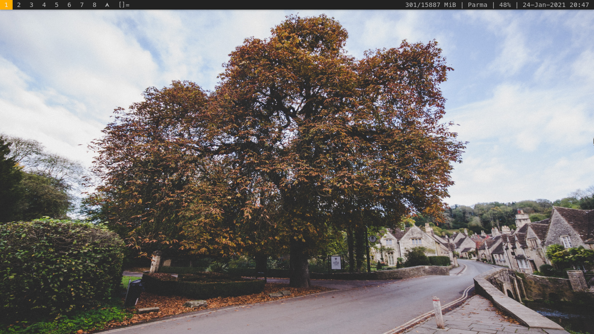
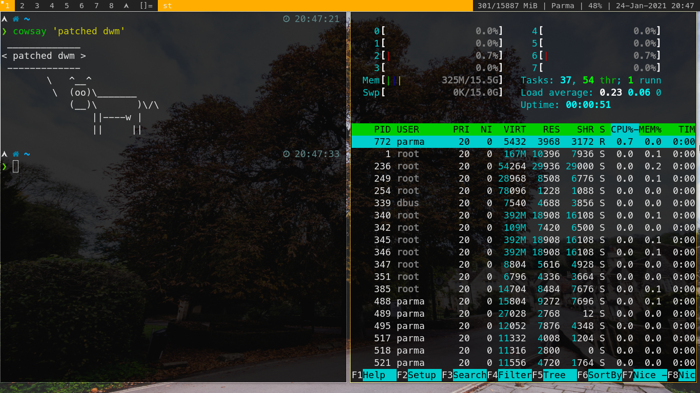

# dwm
Parma's Patched dynamic window manager from suckless.
For original files (unpatched) visit https://dwm.suckless.org/

# Installation
First, install some packages.

> Arch Linux -- 
`sudo pacman -S base-devel git libx11 libxft xorg-server xorg-xinit`

Then, create your own folder for dwm

```
git clone https://github.com/parmariza/dwm.git
cd dwm
sudo make install
```

Create file `.xinitrc` in your home directory.
```
dte() {
    dte="$(date +"%d-%b-%Y %H:%M")"
    echo -e "$dte"
}

mem() {
    mem=`free | awk '/Mem/ {printf "%d/%d MiB\n", $3 / 1024.0, $2 / 1024.0 }'`
    echo -e "$mem"
}

battery() {
    battery="$(cat /sys/class/power_supply/BAT0/capacity)%"
    echo -e "$battery"
}

statusbar() {
    statusbar="$(mem) | <change_this> | $(battery) | $(dte) "
    echo -e "$statusbar"
}

# Statusbar loop
while true; do
    xsetroot -name " $(statusbar)"
    sleep 1m
done &

# Run dwm
exec dwm
```

All set. Reboot your computer.
Run dwm with `startx` on tty.

# Screencapture





# Testing Status
Tested on my Computer (Arch Linux).

