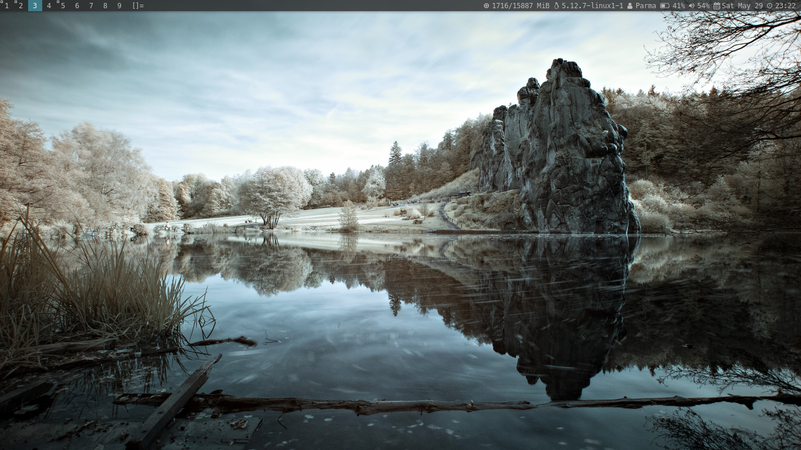
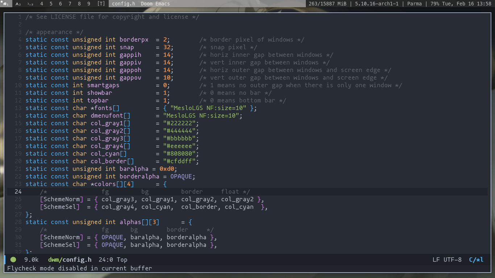
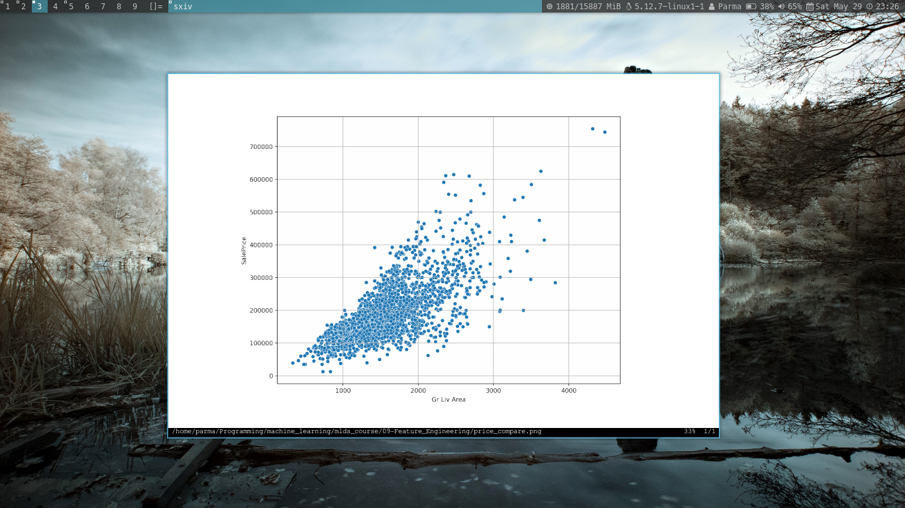

dwm - dynamic window manager
----------------------------
dwm is an extremely fast, small, and dynamic window manager.
this dwm is configured by Parma.
for original dwm visit: [Original dwm](https://dwm.suckless.org/)

Images
------

Requirements
------------
In order to build dwm you need the Xlib header files.

Installation
------------
create directory for some dwm's files.
run on terminal: sudo make install

## Configured .xinitrc
------------------
put .xinitrc file in your home directory

Running dwm default xinitrc
---------------------------
Add the following line to your .xinitrc to start dwm using startx:

    exec dwm

In order to connect dwm to a specific display, make sure that
the DISPLAY environment variable is set correctly, e.g.:

    DISPLAY=foo.bar:1 exec dwm

(This will start dwm on display :1 of the host foo.bar.)

In order to display status info in the bar, you can do something
like this in your .xinitrc:

    while xsetroot -name "`date` `uptime | sed 's/.*,//'`"
    do
    	sleep 1
    done &
    exec dwm

Configuration
-------------
The configuration of dwm is done by creating a custom config.h
and (re)compiling the source code.
