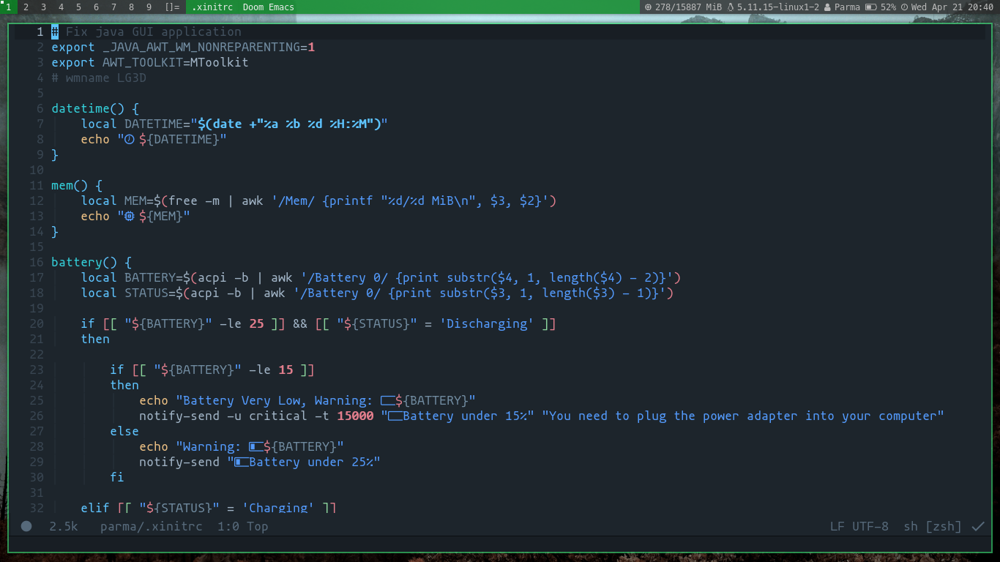

dwm - dynamic window manager
----------------------------
dwm is an extremely fast, small, and dynamic window manager.

this dwm is configured by Parma.

for original dwm visit (special thanks): [dynamic window manager - suckless.org](https://dwm.suckless.org/)

Some patches for dwm (special thanks): [dwm patch - suckless.org](https://dwm.suckless.org/patches/)

Images
------

wallpaper source: [click here for wallpaper](https://unsplash.com/photos/KL98S4b33rI)

dmenu: [suckless - dmenu](https://tools.suckless.org/dmenu/)

Statistical data visualization: [seaborn](https://github.com/mwaskom/seaborn)
png viewer: [sxiv](https://github.com/muennich/sxiv)

text editor: [doom emacs](https://github.com/hlissner/doom-emacs)

Requirements
------------
In order to build dwm you need the Xlib header files.

## Font
---------
Nerd font: [click here for nerd-fonts](https://github.com/ryanoasis/nerd-fonts)

Installation
------------
create directory for some dwm's files.
run on terminal: sudo make install

## Configured .xinitrc
----------------------
put .xinitrc file in your home directory
`cp xinitrc ~/.xinitrc`

Running dwm (default xinitrc)
---------------------------
Add the following line to your .xinitrc to start dwm using startx:

    exec dwm

In order to connect dwm to a specific display, make sure that
the DISPLAY environment variable is set correctly, e.g.:

    DISPLAY=foo.bar:1 exec dwm

(This will start dwm on display :1 of the host foo.bar.)

In order to display status info in the bar, you can do something
like this in your .xinitrc:

    while xsetroot -name "`date` `uptime | sed 's/.*,//'`"
    do
    	sleep 1
    done &
    exec dwm

Configuration
-------------
The configuration of dwm is done by creating a custom config.h
and (re)compiling the source code.

