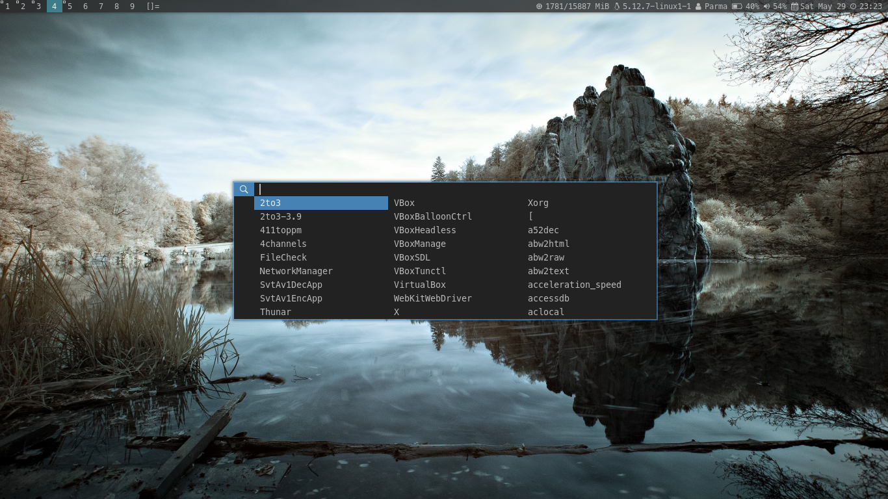

dwm - dynamic window manager
----------------------------
dwm is an extremely fast, small, and dynamic window manager.
this dwm is configured by Parma.
for original dwm visit: [Original dwm](https://dwm.suckless.org/)

Images
------





Requirements
------------
In order to build dwm you need the Xlib header files.


Installation
------------
create directory for some dwm's files.
run on terminal: sudo make install

## Configured .xinitrc
------------------
```# Fix java GUI application
export _JAVA_AWT_WM_NONREPARENTING=1 
export AWT_TOOLKIT=MToolkit 
# wmname LG3D

datetime() {
    datetime="$(date +"%a, %b %d %H:%M")"
    echo -e "$datetime"
}

mem() {
    mem=`free | awk '/Mem/ {printf "%d/%d MiB\n", $3 / 1024.0, $2 / 1024.0 }'`
    echo -e "$mem"
}

battery() {
    battery="$(cat /sys/class/power_supply/BAT0/capacity)%"
    echo -e "$battery"
}

battery2() {
	battery2=`acpi | grep 'Battery 0' | grep -oP '(?<=, )\d+(?=%)'`

	if [ "$battery2" -le 25 ]
	then
		echo -e "Warning: $battery2"
	else
		echo -e "$battery2"
	fi
}

kernel_release() {
    kernel_release="$(uname -r)"
    echo -e "$kernel_release"
}

statusbar() {
    statusbar="$(mem) | $(kernel_release) | Parma | $(battery2)% $(datetime) "
    echo -e "$statusbar"
}

# Statusbar loop
while true; do
    xsetroot -name " $(statusbar)"
    sleep 1m
done &

# Wallpaper
feh --bg-scale ~/Pictures/Wallpapers/emil-karlsson-YfjdfsKQBsA-unsplash.jpg

# Export something
export BROWSER=/usr/bin/google-chrome-stable
export EDITOR=nvim

# deleted command
# remove dbus-launch 

# Autostart picom
~/Riza/picom_autostart/picom.sh

# Run dwm
exec dwm```


Running dwm default xinitrc
---------------------------
Add the following line to your .xinitrc to start dwm using startx:

    exec dwm

In order to connect dwm to a specific display, make sure that
the DISPLAY environment variable is set correctly, e.g.:

    DISPLAY=foo.bar:1 exec dwm

(This will start dwm on display :1 of the host foo.bar.)

In order to display status info in the bar, you can do something
like this in your .xinitrc:

    while xsetroot -name "`date` `uptime | sed 's/.*,//'`"
    do
    	sleep 1
    done &
    exec dwm


Configuration
-------------
The configuration of dwm is done by creating a custom config.h
and (re)compiling the source code.
